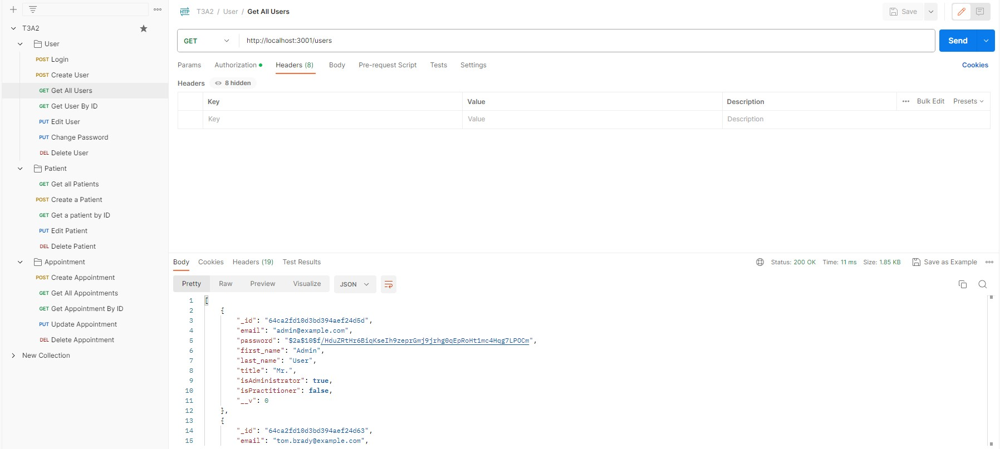

# Postman test log

| Feature  | Route | HTTP Method | Outcome | Comments |
| ------------- | ------------- | ------------- | ------------- | ------------- |
| Sign in  | /  | POST  | Passed  | Return with a token  |
| Create User | /users  | POST  | Passed  | No issue  |
| View all users  | /users | GET  | Passed  | No issue |
| View user by ID  | /users/:userid  | GET  | Passed  | No issue  |
| Edit User  | /users/:userid  | PUT  | Passed  | No issue |
| Change Password  | /users/:userid/password  | PUT  | Passed  | No issue |
| Delete User  | /users/:userid  | DELETE  | Passed  | No issue |
| Create new Patient  | /paitents  | POST  | Passed  | No issue |
| View all Patients  | /paitents  | GET  | Passed  | No issue |
| View Patient by id  | /paitents/:paitentid  | GET  | Passed  | No issue |
| Edit Patient  | /paitents/:paitentid  | PUT  | Passed  | No issue  |
| Delete Patient  | /paitents/:paitentid  | DELETE  | Passed  | No issue |
| Create new Appointment  | /appointments  | POST  | Passed  | No issue |
| View all Appointment  | /appointments  | GET  | Passed  | No issue |
| View Appointment by id  | /appointments/:appointmentid  | GET  | Passed | No issue  | 
| Edit Appointment  | /appointments/:appointmentid  | PUT  | Passed  | No issue  |
| Delete Appointment  | /appointments/:appointmentid  | PUT  | Passed  | No issue  |

## Screenshots of postman

* Summary of routes
  
  

* Sign in
  
  

*  Create User
  
    

* Get All Users

    

* Get User without Authorization
  
  

*  Get User By ID
  
    

*  Edit User
  
    

*  Change Password
  
      

*  Delete User
  
  

*  Create Patient Exsited Email
  
      

*  Create Patient
  
    

* Get All Patients

    

*  Get Patient By ID
  
    

*  Edit Patient
  
    

*  Delete Patient
  
        

*  Create Appointment
  
    

* Get All Appointments

    

*  Get Appointment By ID
  
    

*  Edit Appointments
  
    

*  Delete Appointments
  
   